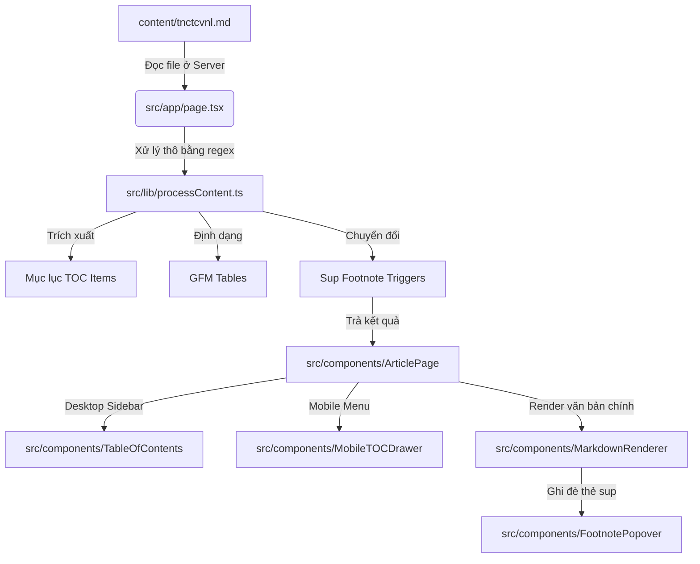

# TNCTCVNL Web App Developer Guide

Tài liệu này hướng dẫn chi tiết dành cho lập trình viên để hiểu rõ cấu trúc kỹ thuật, quy trình xử lý nội dung văn bản và cách phát triển mở rộng ứng dụng web **Tầm Nhìn Của Thiên Chúa Về Nhân Loại (TNCTCVNL)**.

---

## 🛠️ Công Nghệ Sử Dụng (Tech Stack)

Dự án được xây dựng dựa trên những công nghệ hiện đại và tối ưu nhất:
- **Framework**: [Next.js v16.2.9](https://nextjs.org/) (App Router, Turbopack)
- **UI Library**: [React v19.2.4](https://react.dev/)
- **Styling**: [Tailwind CSS v4](https://tailwindcss.com/) & Vanilla CSS custom design tokens
- **Markdown Processing**: 
  - `react-markdown` (Biên dịch Markdown sang React components)
  - `remark-gfm` (Hỗ trợ định dạng bảng, gạch ngang, liên kết tự động)
  - `rehype-raw` (Hỗ trợ render các thẻ HTML an toàn lồng trong Markdown như `<sup>`, `<sub>`)
  - `rehype-slug` (Tự động thêm id cho các tiêu đề heading)
- **Lưu trữ ngoại tuyến (PWA)**: Service Worker API thuần kết hợp cấu hình `manifest.json`.

---

## 🏗️ Kiến Trúc Và Xử Lý Dữ Liệu (Data Flow)

Quy trình tải nội dung từ file Markdown tĩnh và hiển thị lên giao diện diễn ra qua 2 giai đoạn chính:



### 1. Phân tích văn bản ở Server (`processContent.ts`)
Khi người dùng truy cập trang chủ, Next.js Server Component đọc tệp `content/tnctcvnl.md`. Trước khi gửi dữ liệu xuống Client, hàm `processMarkdownContent` sẽ:
- **Tách nội dung & Tài liệu tham khảo**: Tìm từ khóa `"Nguồn trích dẫn"` hoặc `"Tài liệu tham khảo"` để cắt đôi tài liệu. Nửa đầu làm nội dung bài viết, nửa sau làm danh sách tài liệu tham khảo.
- **Tự động gắn thẻ Heading (`#`, `##`, `###`)**: Quy đổi tiêu đề dòng đầu tiên thành `# (H1)`, các đề mục dạng `1. ` thành `## (H2)` và các phụ mục dạng `1.1. ` thành `### (H3)`.
- **Chuyển đổi Footnote**: Sử dụng Regex `(\p{L})(\d{1,2})(?=\b|[\p{P}]|$)` để tìm các chữ số dính liền sau ký tự chữ cái (Ví dụ: `Ngài1`) và thay thế thành cấu trúc HTML `<sup class="footnote-ref" data-idx="1">1</sup>`.
- **Dựng bảng so sánh học thuật**: Nhận diện dòng bắt đầu bằng `"Chiều Kích Phân Tích"` và chuyển cấu trúc so sánh dạng khối văn bản dòng đôi thành cấu trúc bảng GFM tiêu chuẩn (`| Cột 1 | Cột 2 |...`).
- **Thống kê thông số đọc**: Tính số lượng từ tiếng Việt và quy đổi ra thời gian đọc trung bình (`200 từ/phút`).

### 2. Dựng giao diện ở Client (Interactive Render)
- **Mục Lục Tự Động Dynamic TOC**: Trình duyệt render danh sách mục lục tĩnh. Khi cuộn trang, `IntersectionObserver` theo dõi các phần tử tiêu đề và cập nhật phần tử hoạt động trên mục lục theo thời gian thực.
- **Popover Chú Thích Thông Minh**: Khi `react-markdown` biên dịch thẻ `<sup>`, nếu phát hiện `className="footnote-ref"`, React sẽ ghi đè và thay thế bằng component `<FootnotePopover />`. Component này sử dụng **React Portal** để chèn trực tiếp popover vào cuối thẻ `<body>`, giúp tránh hoàn toàn các lỗi bể bố cục do `overflow: hidden` hoặc `z-index` của cha gây ra.

---

## 🎨 Hệ Thống Thiết Kế (Design System)

Tất cả các màu sắc và biến kích thước được khai báo tập trung trong `src/app/globals.css` dưới dạng CSS Variables. Các lớp Tailwind v4 sử dụng trực tiếp các biến này thông qua cơ chế `@theme`.

### Biến CSS Chủ Đạo (Light Mode):
```css
:root {
  --parchment: #F9F6F0;       /* Nền giấy da sáng */
  --parchment-dark: #F0EBE0;  /* Nền các khung chứa phụ */
  --charcoal: #333333;        /* Chữ chính */
  --burgundy: #722F37;        /* Tiêu đề chính H1, H2, Đỏ rượu nho */
  --gold: #B8860B;            /* Chi tiết trang trí, Gold */
  --royal-blue: #2C3E6B;      /* Màu sắc học thuật cho Link & Nguồn */
}
```

### Chế độ Tối (Dark Mode)
Ứng dụng chuyển đổi giao diện bằng cách thêm hoặc xóa class `.dark` trên thẻ `<html>`.
```javascript
// Đoạn code xử lý chuyển đổi theme tại SiteHeader.tsx
const toggleTheme = () => {
  if (document.documentElement.classList.contains("dark")) {
    document.documentElement.classList.remove("dark");
    localStorage.setItem("theme", "light");
  } else {
    document.documentElement.classList.add("dark");
    localStorage.setItem("theme", "dark");
  }
};
```

---

## 🧩 Các Components Quan Trọng

### 1. [MarkdownRenderer.tsx](file:///d:/TNCTCVNL/tnctcvnl-web/src/components/MarkdownRenderer.tsx)
Chịu trách nhiệm hiển thị cấu trúc văn bản. Nó ghi đè các phần tử HTML mặc định:
- Thêm biểu tượng liên kết nhanh khi hover vào các thẻ `h2`, `h3` để chia sẻ liên kết neo (anchor link).
- Chèn Component `SectionDivider` (Thánh Giá trang trí học thuật) khi gặp thẻ `<hr />` (`___` trong Markdown).
- Sử dụng `FootnotePopover` thay thế cho thẻ `sup` có class `.footnote-ref`.

### 2. [FootnotePopover.tsx](file:///d:/TNCTCVNL/tnctcvnl-web/src/components/FootnotePopover.tsx)
- Quản lý trạng thái đóng/mở popover hiển thị chú thích.
- Chức năng tự định vị: Đo tọa độ nút bấm (`getBoundingClientRect()`) và tính toán vị trí hộp thoại (ưu tiên hiển thị phía trên nút, tự động nhảy xuống dưới nếu chạm mép trên của màn hình).
- Đóng thông minh: Hộp thoại tự đóng khi người dùng rê chuột ra ngoài (sau 300ms trì hoãn) hoặc khi nhấp chuột ra ngoài vùng chú thích.

### 3. [ChantPlayer.tsx](file:///d:/TNCTCVNL/tnctcvnl-web/src/components/ChantPlayer.tsx)
- Sử dụng thẻ `<audio>` ẩn kèm hiệu ứng sóng âm nhạc (visualizer) chuyển động theo nhịp nhạc nền.
- Cấu hình phát lặp (`loop`), giảm mức âm lượng mặc định xuống `15%` để tạo không gian đọc tập trung, không gây ồn ào.

---

## ⚡ Cấu Hình PWA & Đọc Ngoại Tuyến

Tệp [manifest.json](file:///d:/TNCTCVNL/tnctcvnl-web/public/manifest.json) và [sw.js](file:///d:/TNCTCVNL/tnctcvnl-web/public/sw.js) được đặt trực tiếp trong thư mục `public/`.

### Cơ Chế Hoạt Động của Service Worker:
1. **Lúc Cài Đặt (`install`)**: Lưu trước các tài nguyên tĩnh quan trọng bao gồm `/`, `/manifest.json`, và `/favicon.ico`.
2. **Lúc Hoạt Động (`fetch`)**:
   - Sử dụng chiến lược **Network-First**: Luôn ưu tiên gửi yêu cầu lên Internet để nhận bản cập nhật nội dung mới nhất.
   - Nếu kết nối mạng thành công, SW tự động cập nhật bản sao phản hồi mới nhất vào Cache.
   - Nếu mất mạng (Offline/Network failure), SW sẽ trả về tài nguyên đã lưu trong Cache để trang web tiếp tục hiển thị bình thường.

---

## 🚀 Kiểm Tra & Build Thực Tế

Trước khi đẩy lên môi trường deploy chính thức, hãy chắc chắn kiểm tra build không có lỗi TypeScript hoặc hydration warning:

```bash
# Xây dựng bản build đóng gói chính thức
npm run build
```

Hệ thống sẽ chạy bộ biên dịch mã nguồn Next.js biên dịch toàn bộ cấu trúc văn bản tĩnh nhằm tối ưu hóa SEO tối đa cho tải trang lần đầu tiên.
